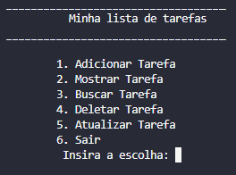

# estudosCpp
Repositório criado para armazenar os projetos feitos para o estudo da linguagem C++

Exercícios na pasta Start foram feitos com base na vídeo aula "Tutorial de C++ para iniciantes - Curso Completo" (https://www.youtube.com/watch?v=vLnPwxZdW4Y&t=7847s)

Uma lista de tarefas está presente na pasta To-Do-List com base na vídeo aula "Todo List Implementation in C++ | File Handling with source code | Urdu/Hindi" (https://www.youtube.com/watch?v=9d49MhvVL8klist=PL7J_qm5CUrZoHa3IFrpkiXtubXSBQ-Nrv&index=12)

A lista de tarefas é capaz de adicionar, mostrar, buscar e deletar tarefas.

